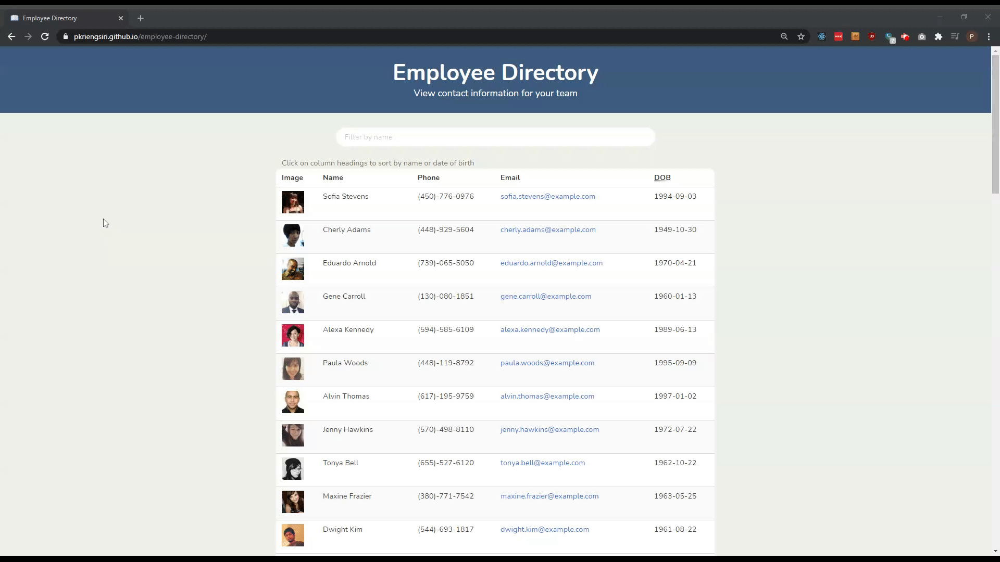

# Employee Directory
A React-based employee directory

## Description
This application is a single-page employee directory.  It was written using JavaScript and the React JavaScript library.  The template for the application was created using the create-react-app npm package.  Styling was performing using CSS and the Bulma CSS framework (with node-sass for compiling .scss to .css).

### Functionality
* View a table of employee information
* Filter employees by name
* Sort employees by name or date of birth

[Link to the repository](https://github.com/pkriengsiri/employee-directory)
  
## Table of Contents
* [Installation](#installation)
* [Usage](#usage)
* [Credits](#credits)
* [License](#license)
* [Contributing](#contributing)
* [Questions](#questions)
  
## Installation
From GitHub, fork the repo and upload all contents to the deployed server.  The server must have Node.js and the . Once forked, run `npm i` from the root directory to install required dependencies.  

Run `npm start` to start the application locally.  

## Usage

Link to the deployed application: https://pkriengsiri.github.io/employee-directory/ 





## Credits
Collaborators on this project included instructional staff, TAs, and students in the Georgia Tech Coding Boot Camp Winter 2020 cohort.

### References
* https://medium.com/@thexap/how-to-setup-bulma-css-framework-with-react-under-5-minutes-a3d8c2c33a87 

## License
This application is covered under MIT License

<details>
  <summary>
    License Text
  </summary> 

```

Copyright (c) 2021  Pete Kriengsiri

Permission is hereby granted, free of charge, to any person obtaining a copy
of this software and associated documentation files (the "Software"), to deal
in the Software without restriction, including without limitation the rights
to use, copy, modify, merge, publish, distribute, sublicense, and/or sell
copies of the Software, and to permit persons to whom the Software is
furnished to do so, subject to the following conditions:
      
The above copyright notice and this permission notice shall be included in all
copies or substantial portions of the Software.
      
THE SOFTWARE IS PROVIDED "AS IS", WITHOUT WARRANTY OF ANY KIND, EXPRESS OR
IMPLIED, INCLUDING BUT NOT LIMITED TO THE WARRANTIES OF MERCHANTABILITY,
FITNESS FOR A PARTICULAR PURPOSE AND NONINFRINGEMENT. IN NO EVENT SHALL THE
AUTHORS OR COPYRIGHT HOLDERS BE LIABLE FOR ANY CLAIM, DAMAGES OR OTHER
LIABILITY, WHETHER IN AN ACTION OF CONTRACT, TORT OR OTHERWISE, ARISING FROM,
OUT OF OR IN CONNECTION WITH THE SOFTWARE OR THE USE OR OTHER DEALINGS IN THE
SOFTWARE.

```
</details>


## Contributing
No contributions are being accepted at this time.
  
## Badges
[](https://github.com/pkriengsiri/employee-directory/issues)
[](https://github.com/pkriengsiri/employee-directory/network)
[](https://github.com/pkriengsiri/employee-directory/stargazers)
[](https://github.com/pkriengsiri/employee-directory)

## Questions
Contact me via [email](mailto:pkriengsiri@gmail.com).
View my GitHub [profile](https://github.com/pkriengsiri).